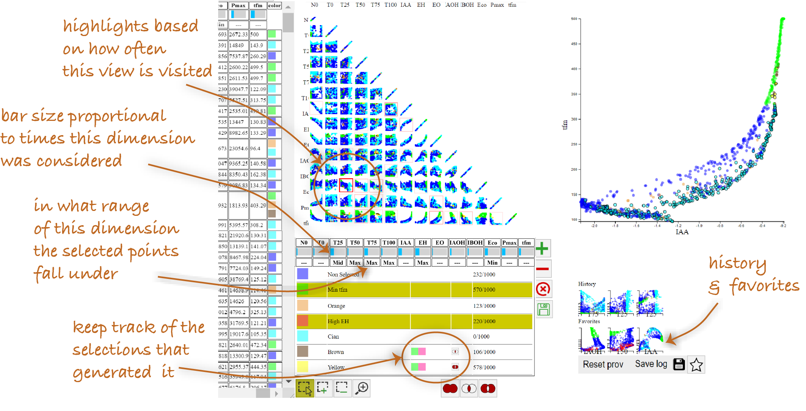

<h1 style="text-align: center;"> VisProm: Visual Provenance for Multidimensional Data Analysis</h1>
<h4><code>D3.js, Provenance, Multidimensional data, tradeoff analysis </code></h4> 

<strong style="color: #000;"></strong>

## About VisProm

VisProm is an interactive visual analytics tool that helps users explore, analyze, and track their exploration process when working with multidimensional data. The tool enhances analytical workflows by maintaining a visual history of user interactions and selections, enabling more insightful data exploration and decision-making.

## Key Features

- **Interactive Visualization Matrix**: Explore relationships between multiple dimensions through a comprehensive scatterplot matrix
- **Visual Provenance Tracking**: Automatically records exploration paths and selection history
- **Usage-Based Highlighting**: Elements are highlighted based on frequency of view visits, providing insight into exploration patterns
- **Dimensional Analysis**: Bar sizes proportional to how often dimensions are considered in analysis
- **Selection Range Tracking**: Visual indicators showing the range of dimensions where selected points fall
- **History & Favorites**: Save and revisit important views and selections for comparison and further analysis
- **Interactive Filtering**: Dynamically filter and select data points across multiple dimensions

## Use Cases

- **Data Exploration**: Discover patterns and relationships across multiple dimensions
- **Decision Support**: Compare alternatives based on multiple criteria
- **Tradeoff Analysis**: Understand compromises between different dimensions
- **Research Documentation**: Track and share analytical reasoning processes
- **Educational Purposes**: Teach data analysis concepts with visual feedback

  <strong style="color: #000;"> Running: </strong>
To run the project execute the command <code>npm start</code> in the project folder then go to the address <code>localhost:3000</code> in your browser

## Getting Started

1. Clone this repository
2. Install dependencies with `npm install`
3. Start the development server with `npm start`
4. Open your browser and navigate to `localhost:3000`

## Changing the Dataset

To visualize your own data in VisProm:

1. Create a CSV file with your multidimensional data
2. Name your file `datasmall.csv`
3. Replace the existing file at `public/data/datasmall.csv` with your file
4. Ensure your CSV uses the same format: column headers in the first row with dimension names, and data points in subsequent rows
5. Restart the application if it's already running

The default dataset included is the Iris flower dataset with dimensions for sepal length, sepal width, petal length, petal width, and species classification.

## How to Use

1. **Data Selection**: Load your multidimensional dataset
2. **Exploration**: Click on different matrix cells to explore dimension relationships
3. **Selection**: Select points of interest on any scatterplot
4. **History**: Review your exploration path in the history panel
5. **Favorites**: Save important views for later reference
6. **Analysis**: Use the proportional bars to understand dimension importance in your exploration

## License

This project is licensed under the [Creative Commons Attribution-NonCommercial 4.0 International License](https://creativecommons.org/licenses/by-nc/4.0/).

You are free to:
- Share — copy and redistribute the material in any medium or format
- Adapt — remix, transform, and build upon the material

Under the following terms:
- Attribution — You must give appropriate credit, provide a link to the license, and indicate if changes were made.
- NonCommercial — You may not use the material for commercial purposes.

